# 🎬 MoviesHub

MoviesHub lets you explore and enjoy the world of cinema at your fingertips. Discover the latest movies, trending movies, and upcoming trailers. Search for your favorite titles, learn more about each movie, and explore similar recommendations. Add movies to your wishlist, stream online, or download to watch later - all in one place.

---

## 🧩 About the Project

MoviesHub brings the world of cinema right to your fingertips.  
It allows you to:

- 🎥 Watch trailers of the latest and trending movies  
- ⭐ Add movies to your personal wishlist 
- 🔍 Search and explore movies by genres  
- 💎 Upgrade to a paid plan for explore and enjoy the world of cinema 

Whether you love action, comedy, or thrillers — MoviesHub has something for everyone!

---

## 🧠 How It Works

1. Login / Sign Up 
   Users can create an account or log in to access the platform.  

2. Browse Movies  
   Explore trending, latest, and genre-based movies with posters and trailers.  

3. Free vs Paid Users
   - 🆓 Free Users → Can only view trailers and limited details.  
   - 💰 Paid Users → Get full access, including exploring, streaming, browsing and downloads.  

4. Upgrade to Paid Plan 
   Submit your transaction details and screenshot to upgrade your account instantly.

---

## ⚙️ Tech Stack

Frontend:  HTML, CSS, JavaScript, Bootstrap  
Backend:  PHP (XAMPP Server)  
Database:  MySQL  
Environment:  XAMPP (Apache + MySQL)  
Editor:  Visual Studio Code  

---

## 🏗️ Folder Structure

```
MoviesHub/
├── admin/                          # Admin dashboard and management tools
│   ├── add.php                     # Movie is Added
│   ├── dashboard.php               # Dasboard for all Movies
│   ├── delete.php                  # Delete a Movie
│   ├── delete_user.php             # Delete a User
│   ├── side_bar.php                # Navigation Bar
│   ├── style.css                   # Admin UI Styling
│   ├── update.php                  # Edit a Movie
│   ├── users.php                   # Fetch all the Users
│
├── media/                          # Media assets (images, screenshots, etc.)
│   ├── screenshots/                # Uploaded payment screenshots
│   ├── png / jpg / webp images     # Collection of movie posters, thumbnails and Screenshots
│
├── SQL/
│   ├── movies.sql                  # Database structure and sample data
│
├──all.php                          # Returns all Movies for Perticular genre
├──cat.php                          # Category Page
├──contact.php                      # Devloper Information and Medium to contact
├──db.php                           # Database Connection
├──details.php                      # Movies Description, Streaming, Adding to Wishlist, and Download
├──footer.php                       # Footer or Basic Information of Website and Devloper
├── index.php                       # Home page (carousel + movie sections)
├──login.php                        # Login Page
├──logout.php                       # Logout Logic
├── README.md                       # Project description
├── payment.php                     # Payment form + file upload
├── profile.php                     # User Profile + View Wishlist Page
├──remove_wishlist.php              # Remove the Movie from Wishlist
├──search.php                       # Movie Search Page
├──side_bar.php                     # Navigation Bar
├──signup.php                       # Registration Page
├──style.css                        # User UI Styling
├── update.php                      # Handles subscription updates
├── wish_list.php                   # Adds Movie to Wishlist
```

---

## ✨ Features

### Users:
✅ User Login & Session Management  
✅ Movie Trailers (via YouTube embed)  
✅ Latest and Trending Movie Display  
✅ Genre-based Movie Display  
✅ Wishlist Functionality  
✅ Free & Paid Account Handling  
✅ Payment Upload with Screenshot  
✅ Auto Subscription Update  
✅ Responsive Web Design  

### Admin:
✅ Movie Management(Add, Edit, and Delete)  
✅ User Management(Delete)  

---

## 🚀 Getting Started (Local Setup)

**Step 1:** Install XAMPP  
Download from [XAMPP Official Website](https://www.apachefriends.org/download.html).

**Step 2:** Move Project Folder  
Place your project inside the `C:\xampp\htdocs\movieshub` directory

**Step 3:** Start Apache and MySQL  
Open XAMPP Control Panel → Start Apache and MySQL.

**Step 4:** Set Up Database  
1. Open phpMyAdmin (http://localhost/phpmyadmin)  
2. Create a new database (movies)  
3. Import your SQL file (in movies database)

**Step 5:** Run the Project  
Open your browser and visit:  
`http://localhost/movieshub`

---

## 💳 Subscription System

**Free:** Watch trailers, browse movies posters  
**Paid:** Full access to content, download movies  

When the payment is Done, the account type is automatically changes to Paid, and the session updates accordingly.

---

## 🧠 Learning Outcome

Even if you’re new to web development, this project will help you understand:
- How websites connect to databases using PHP + MySQL  
- How sessions manage login and account data  
- How dynamic movie listings work  
- How payment and account type updation are handled  

---

## 📸 Preview

- 💻 Login and Signup  
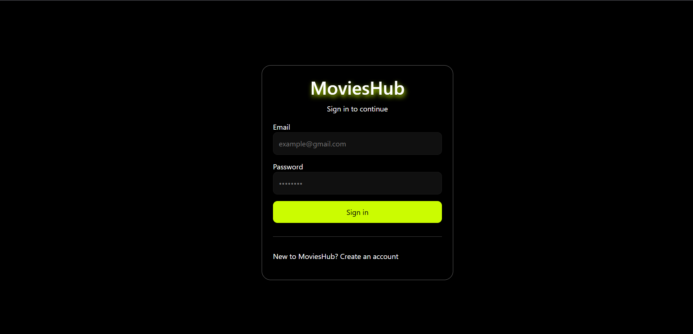  
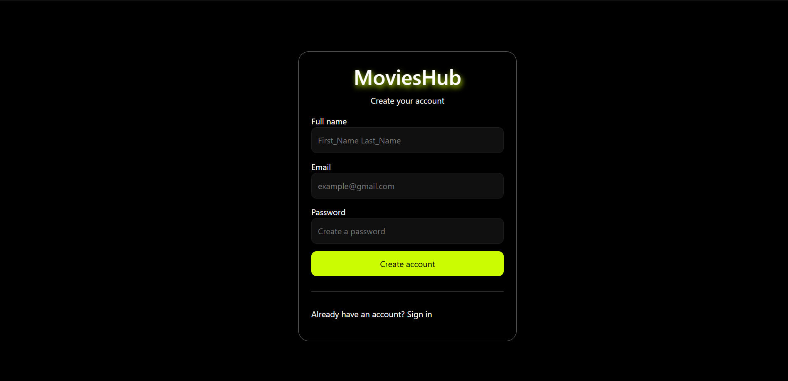

- 🎞️ Movie carousel showing trailers, latest and trending Movies  
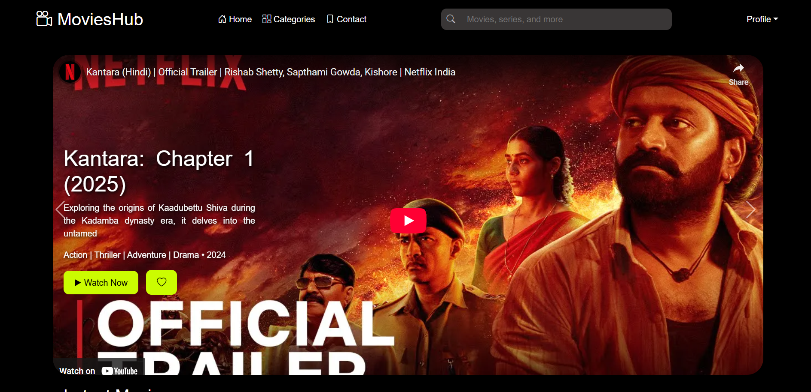  
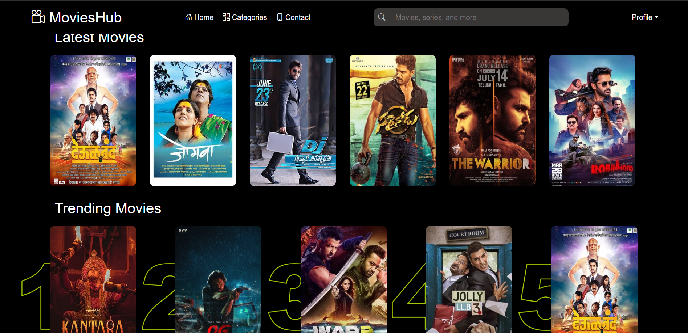

- 💰 Subscription  
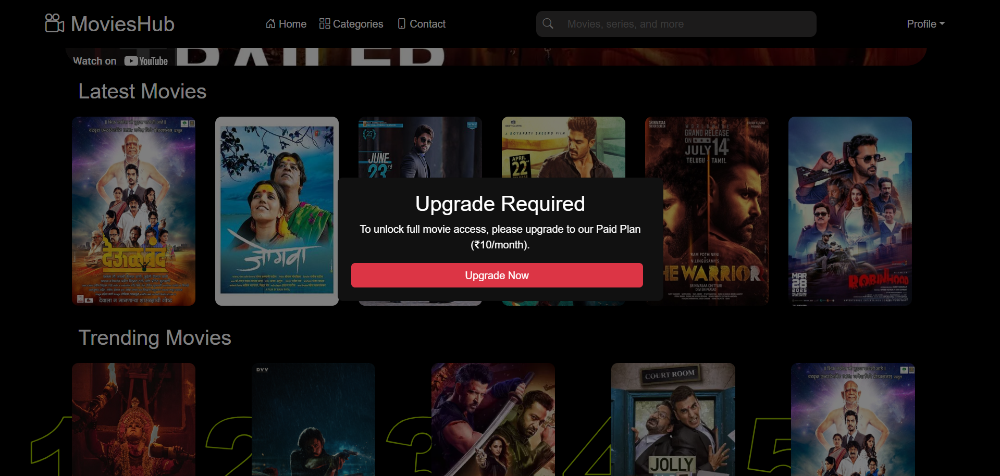  
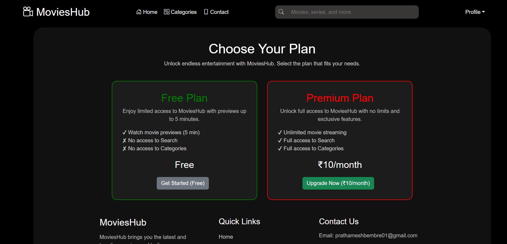  
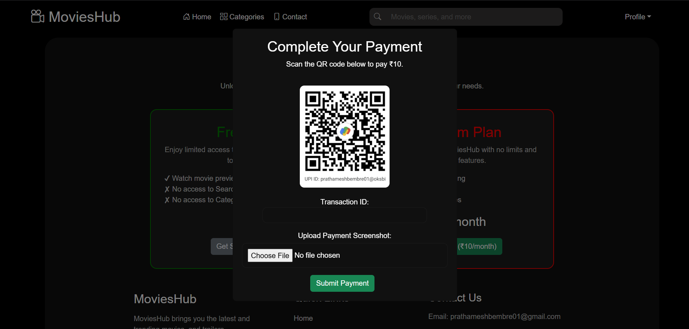

- 🖼️ Movie detail popup  
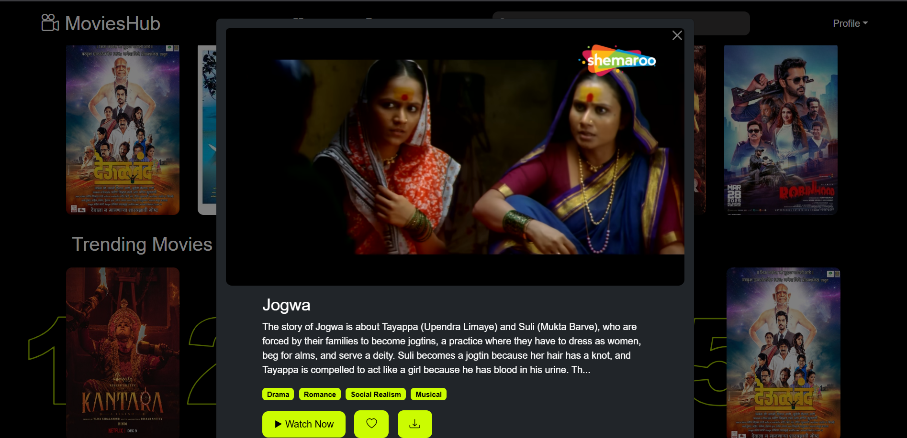  
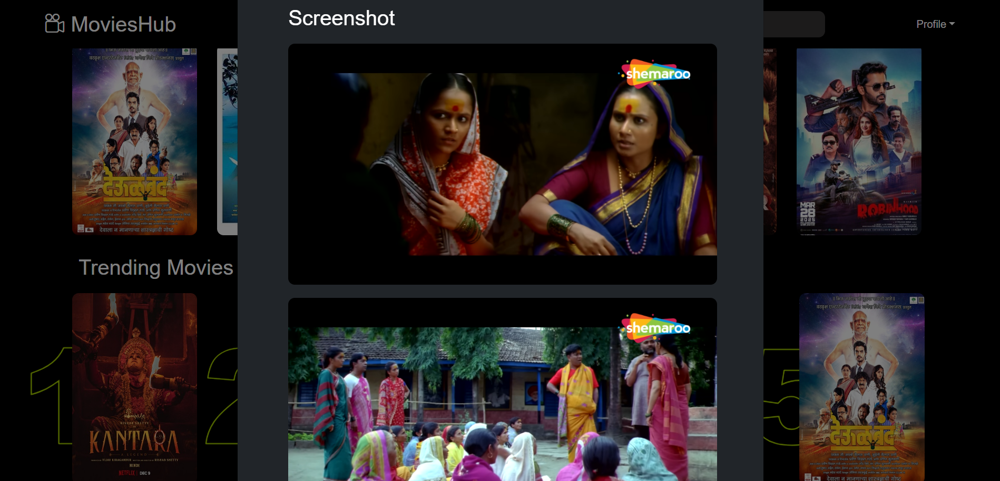  
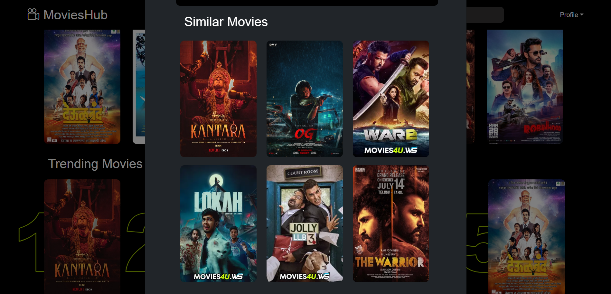

- 👨‍💻 Profile and Wishlist  
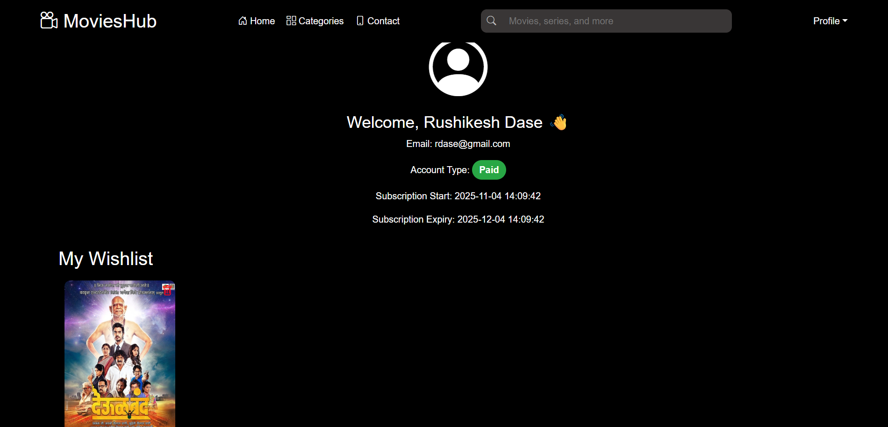

**Admin**  
- 🎥 Dashboard and Movie Management  
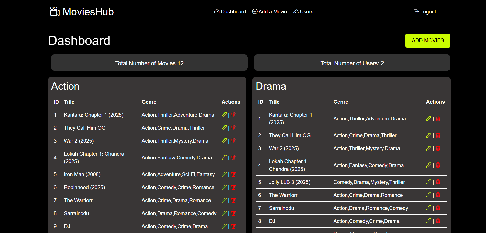

- 🎞️ Adding Movie  
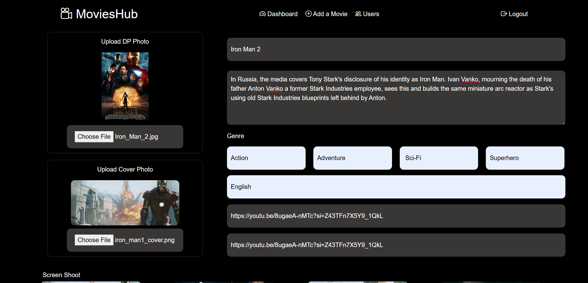  
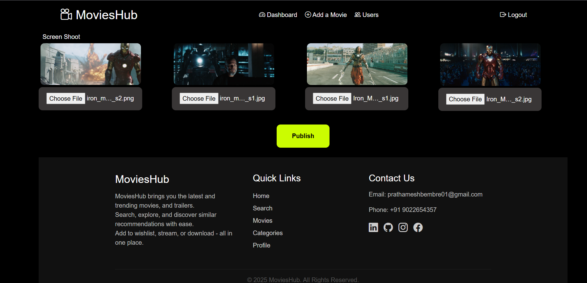  

- 👨‍💻 User Management  
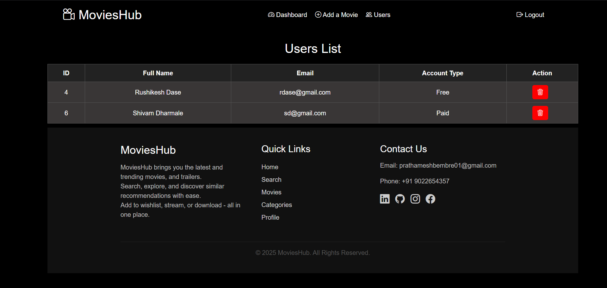

---

## 👨‍💻 Author

**Prathamesh Bembre**  
🎓  IT graduate | 💻 Full Stack Developer  
📧 *prathameshbembre01@gmail.com*  
🔗 [linkedin.com/in/bembre](#)

---

## 🏁 Conclusion

MoviesHub isn’t just a movie website — it’s your all-in-one cinema hub.  
Whether you’re discovering the latest releases or streaming your favorites, MoviesHub brings entertainment closer than ever.
